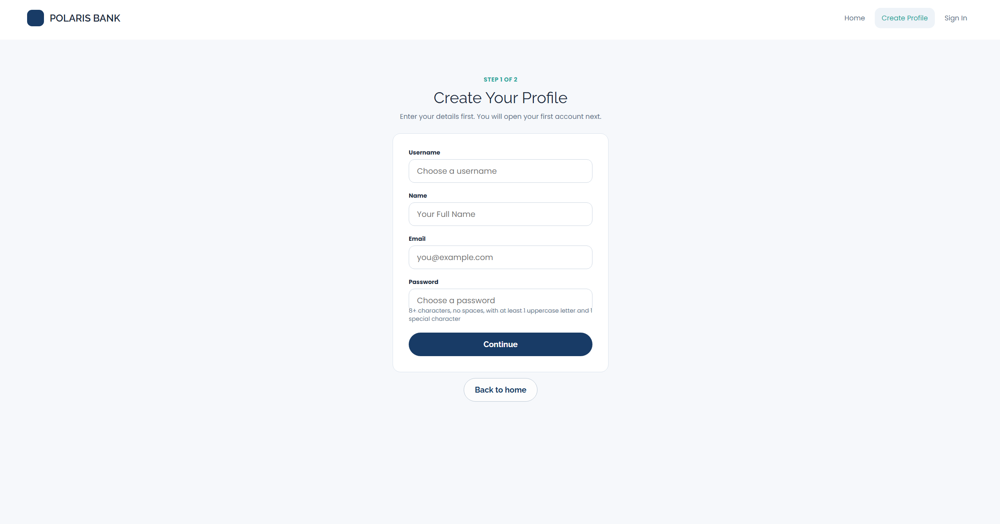
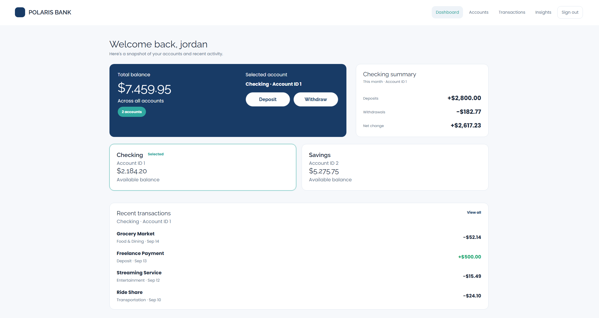
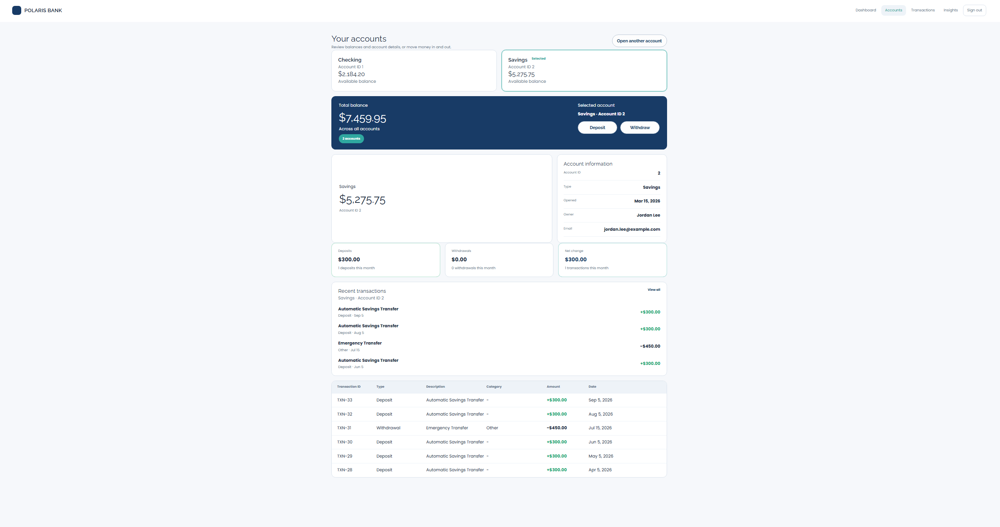
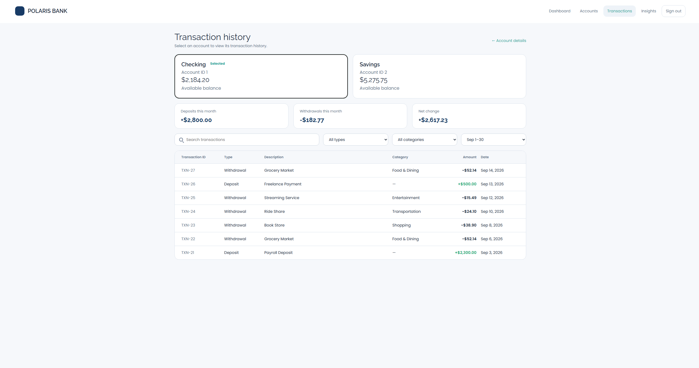
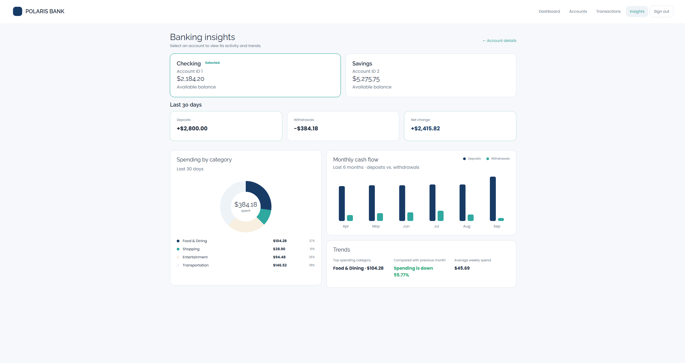

# Banking App

A full-stack banking application built with a FastAPI backend, MongoDB data storage, and a React frontend. Users can create a profile, sign in, open bank accounts, view account details, deposit money, withdraw money, review transaction history, and view account insights.

## Features

* Create a user profile and sign in with JWT authentication.
* Store the signed-in user's token in the frontend and send it with protected API requests.
* Open checking or savings accounts.
* View account details and all accounts for the signed-in user.
* Deposit and withdraw money with validation.
* Maintain transaction records for deposits and withdrawals.
* View transaction history, summaries, categories, and banking insights.
* Protect banking routes so users can only access their own accounts.

## Tech Stack

* Backend: FastAPI, Python, PyJWT, bcrypt
* Frontend: React, Vite, HTML, CSS, JavaScript
* Database: MongoDB / MongoDB Atlas
* Testing and API tools: pytest, Swagger UI, Postman

## Architecture

```text
Frontend UI
    ->
REST API controllers
    ->
Service layer
    ->
Repository layer
    ->
MongoDB
```

Project structure:

```text
backend/
  app/
    controllers/   API route handlers
    services/      Business logic
    repositories/  MongoDB access
    schemas/       Request and response models
    data/          Sample seed data
    main.py        FastAPI app setup
    database.py    MongoDB connection
  scripts/
    seed_mongodb.py
  tests/
  requirements.txt

frontend/
  src/
    api/           Frontend API helpers and token storage
    components/    Shared UI components
    hooks/         Route and banking data hooks
    pages/         App screens
  package.json
```

## Setup

Create a local `.env` file in the repository root using `.env.example` as a guide:

```text
MONGODB_URI=mongodb+srv://<username>:<password>@<cluster-url>/?retryWrites=true&w=majority&appName=Cluster0
MONGODB_DB_NAME=banking_app
JWT_SECRET_KEY=<your-local-secret>
ACCESS_TOKEN_EXPIRE_MINUTES=60
```

Install backend dependencies:

```bash
pip install -r backend/requirements.txt
```

Install frontend dependencies:

```bash
cd frontend
npm install
```

## Run Locally

From the repository root, start the backend:

```bash
uvicorn backend.app.main:app --reload
```

The API runs at:

```text
http://127.0.0.1:8000
```

In a second terminal, start the frontend:

```bash
cd frontend
npm run dev
```

The frontend runs at:

```text
http://127.0.0.1:5173
```

## Seed Data

To load sample users, accounts, and transactions into MongoDB, run:

```bash
python backend/scripts/seed_mongodb.py
```

The seed data lives in:

```text
backend/app/data/sample_data.py
```

## API Documentation

FastAPI provides interactive API documentation:

* Swagger UI: `http://127.0.0.1:8000/docs`
* ReDoc: `http://127.0.0.1:8000/redoc`

Swagger can be used to inspect request and response shapes. Postman is useful for saving a collection of test requests, especially requests that include Authorization headers.

## Main Endpoints

| Method | Endpoint | Purpose |
| ------ | -------- | ------- |
| GET | `/health` | Check whether the API is running |
| POST | `/signup` | Create a user and return an access token |
| POST | `/signin` | Sign in and return an access token |
| POST | `/logout` | Validate token and sign out on the client |
| POST | `/api/accounts` | Create a bank account |
| GET | `/api/accounts/{account_id}` | Get account details |
| GET | `/api/users/{user_id}/accounts` | Get all accounts for a user |
| POST | `/api/accounts/{account_id}/deposit` | Deposit money |
| POST | `/api/accounts/{account_id}/withdraw` | Withdraw money |
| GET | `/api/accounts/{account_id}/transactions` | Get transaction history |
| GET | `/api/accounts/{account_id}/transactions/summary` | Get transaction totals |
| GET | `/api/accounts/{account_id}/transactions/categories` | Get withdrawal categories |
| GET | `/api/accounts/{account_id}/insights` | Get banking insights |

Protected endpoints require this header:

```text
Authorization: Bearer <access_token>
```

## Frontend Auth Flow

The frontend stores the JWT returned from signup or signin in local storage under:

```text
banking_app_token
```

The shared API helper adds the token to protected requests. Signing out clears the token and returns the user to the public home page. On refresh, the app reads the stored token and user id so the signed-in experience can reload.

## Testing

Run backend tests:

```bash
python -m pytest -p no:cacheprovider backend/tests
```

Build the frontend:

```bash
cd frontend
npm run build
```

Recommended Postman collection requests:

* Signup or signin
* Create account
* Get account details
* Get user accounts
* Deposit
* Withdraw
* Transaction history
* No token returns `401`
* Bad token returns `401`
* Accessing another user's account returns `403`

## Media

### Create Profile



### Dashboard



### Accounts



### Transactions



### Insights


